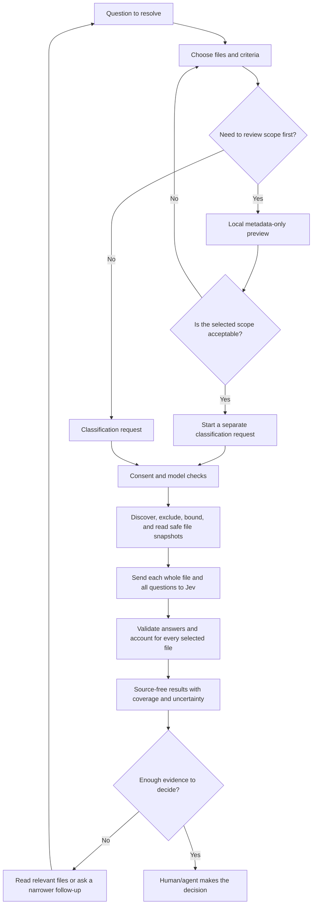
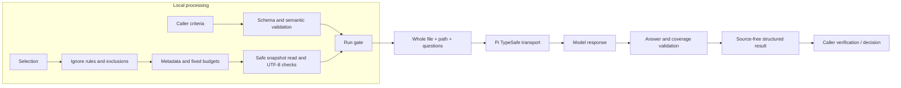

# Cognitive model

This document explains the work that `classify_files` supports and the mental
model callers need to use it safely. The extension is a structured analysis tool
for Pi codemode, not a graphical interface or an autonomous project memory. Its
main user is an agent or person deciding what to inspect; Pi carries the request
and presents the result.

## Mental model

Think of one run as a bounded evidence-gathering loop:

A preview is a scope check, not a commitment or frozen snapshot. Classification
repeats selection and source checks. The model's answer is evidence, not a
verified fact, and the final decision stays with the caller.

## Decision-making process

| Step | Caller decision | System response | Cognitive purpose |
| --- | --- | --- | --- |
| 1. Frame | State a concrete question and define what counts as each answer. | Accepts caller-defined bool, choice, or score questions. | Moves criteria out of vague working memory and into an explicit request. |
| 2. Scope | Choose relative paths or include/exclude globs. | Applies ignore rules, exclusions, eligibility checks, and fixed budgets. | Limits attention to a tractable set; prevents scope silently expanding past the contract. |
| 3. Preview (optional) | Decide whether the listed metadata is the intended scope. | Shows selected paths and sizes locally; does not read content or contact the provider. | Supports a deliberate check before remote disclosure. |
| 4. Authorize | Decide whether remote submission is permitted for this Pi process. | Requires startup consent, then resolves the fixed model and credentials. | Keeps disclosure authorization distinct from merely having credentials. |
| 5. Gather evidence | Decide whether whole-file analysis is appropriate. | Reads bounded snapshots, checks path and file safety, and submits each eligible file with all questions. | Offloads repetitive file-by-file comparison while preserving the source boundary. |
| 6. Assess | Review coverage, status, answer probabilities/confidence, and usage. | Validates answer shape; reports classified, skipped, failed, and unprocessed files separately. | Makes missing evidence visible instead of turning it into a negative answer. |
| 7. Act or refine | Accept the evidence, read selected files, or ask a narrower follow-up. | Returns no source text; supports exact-path follow-up by the caller. | Keeps judgment and deeper verification with the human/agent. |

## Attention

The caller's attention is needed for the high-value judgments: question framing,
selection, disclosure approval, and interpretation. The extension takes on
mechanical work: discovery, sorting, safe reads, per-file request dispatch,
answer checks, and coverage accounting.

The main attention hazards are:

- **Scope mistaken for content review.** Preview reveals metadata only. It does
  not show what a file contains or prove that later classification reads the
  same snapshot.
- **Automation bias.** A well-formed answer or high confidence can still be
  wrong. The caller should inspect underlying files when the decision is
  consequential.
- **Coverage blindness.** A partial scan can look like a complete answer if the
  caller reads only classified answers. Check scan status and per-file outcomes.
- **Question ambiguity.** The tool accepts caller-defined criteria; it cannot
  repair an unclear question or infer the intended decision policy.
- **Disclosure surprise.** Classification submits the whole eligible file and
  questions, not just matching excerpts. Preview and startup consent are
  separate controls, and filename exclusions do not detect embedded secrets.

## Information processing

The pipeline does not execute project content. The content is treated as
untrusted evidence. Local safeguards reduce accidental disclosure but are not
secret detection or an OS sandbox. Request limits and deadlines constrain the
work; cancellation does not guarantee immediate cancellation of native I/O or
an uncooperative provider request.

## Memory model

There is no persistent source cache or project memory in the extension.

| Information | Where it lives | What callers should remember |
| --- | --- | --- |
| Question and selection | Current tool request | Criteria are caller-owned and must be explicit for each request. |
| Preview | Current result / caller working context | Metadata only; it is not a frozen source snapshot. A later classification repeats discovery and checks. |
| Source text | Local read, then provider request | The extension does not return it in results. Eligible files can still contain secrets. |
| Answers and coverage | Structured tool result | Results contain paths and digests but no source; they may still be sensitive. Confidence is not proof. |
| Prior classifications | Caller, Pi session, or codemode storage | Retention follows Pi's rules; the extension does not provide durable project memory. Recheck current files before relying on old results. |
| Resource state | One live classifier instance | Scan and request capacity is shared while that runner is active; reload while requests are pending is unsafe. |

For reliable handoff, the caller should carry forward the question, selected paths,
scan status, and any unresolved outcomes—not just a summary answer. For a
follow-up, use exact paths and ask a focused question; then read relevant files
before making a high-impact decision.

## Human-agent interaction goals and limits

The current design supports lower cognitive load by using one tool with two
clear modes, schema-owned question shapes, bounded selection, explicit coverage,
and source-free results. It supports lower human error by requiring startup
consent, checking snapshots and paths, validating model answers, and keeping
missing evidence distinct from negative evidence.

The interface is codemode-only. It does not currently provide a visual review
screen, an interactive preview-to-submit confirmation, persistent result
history, or plain-language explanations of every exclusion. Agents must render
and interpret the structured output. Do not assume those interaction aids exist.

## Usability testing plan

No usability study is implied by this architecture review. Validate the mental
model with representative Pi users and agents before claiming usability gains.
Use synthetic repositories and local transport; do not send participant or
customer source to a live provider.

### Tasks

1. **Scope safely:** Given a project and a question, select relevant files. Use
   preview and explain what it does and does not establish.
2. **Authorize knowingly:** Explain what classification sends, distinguish an
   API key from startup consent, and handle consent refusal.
3. **Interpret incomplete evidence:** Given mixed classified, skipped, failed,
   and unprocessed outcomes, decide whether the question is answered and name
   the next verification step.
4. **Avoid automation bias:** Given a plausible but uncertain answer, state what
   evidence would justify trusting it and inspect a relevant file.
5. **Follow up efficiently:** Narrow a broad result to exact paths and formulate
   one focused follow-up question.

### Observe and measure

- Task completion and time to a defensible decision.
- Wrong selections, missed exclusions, and unnecessary broad selections.
- Whether participants incorrectly believe preview reads content or freezes the
  selection.
- Whether they understand whole-file remote submission and startup consent.
- Whether partial coverage or uncertainty is overlooked.
- Unnecessary rereads, repeated broad scans, and help requests.
- Confidence calibration: confidence in the decision compared with whether the
  participant correctly identifies limitations and missing evidence.

Use think-aloud observation and a short post-task interview to locate confusing
terms and output fields. Treat usability as a measured property, not something
established by passing unit or E2E tests. Record task scripts, synthetic data,
participant roles, observed errors, and changes made so later runs are repeatable.
